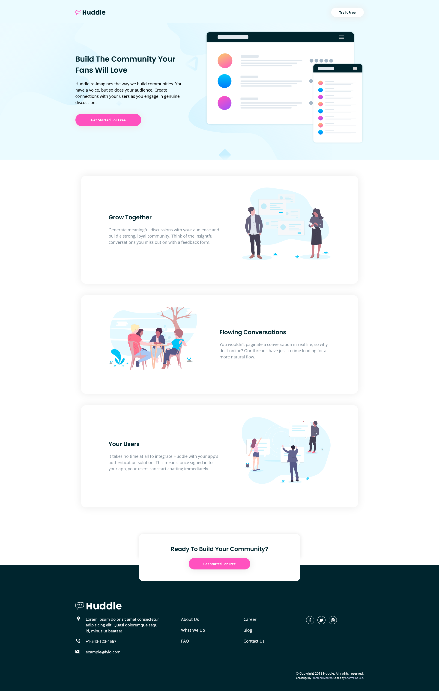

# Frontend Mentor - Huddle landing page with alternating feature blocks solution

This is a solution to the [Huddle landing page with alternating feature blocks challenge on Frontend Mentor](https://www.frontendmentor.io/challenges/huddle-landing-page-with-alternating-feature-blocks-5ca5f5981e82137ec91a5100). Frontend Mentor challenges help you improve your coding skills by building realistic projects.

## Table of contents

- [Overview](#overview)
  - [The challenge](#the-challenge)
  - [Screenshot](#screenshot)
  - [Links](#links)
- [My process](#my-process)
  - [Built with](#built-with)
  - [What I learned](#what-i-learned)
  - [Continued development](#continued-development)
  - [Useful resources](#useful-resources)
- [Author](#author)
- [Acknowledgments](#acknowledgments)

## Overview

### The challenge

Users should be able to:

- View the optimal layout for the site depending on their device's screen size
- See hover states for all interactive elements on the page

### Screenshot

### Links

- Solution URL: [Click here!](https://www.frontendmentor.io/solutions/responsive-landing-page-html-css-flexbox-mobilefirst-bEAImFXe2)
- Live Site URL: [Click here!](https://cranky-yalow-a3eb5b.netlify.app/)

## My process

### Built with

- Semantic HTML5 markup
- CSS custom properties
- Flexbox
- Mobile-first workflow

### What I learned

For this project I tried using the root pseudo-class to declare more global CSS variables, and I must say that it has made my coding experience a whole lot better and faster, especially with the font sizes of elements. For sure I will be continue to use it for my future projects. I've also learnt that pseudo-elements like ::before and ::after can be used to restrict the area of box shadow on an object.

### Continued development

I hope to get myself familiarise with using the pseudo-elements as they are still quite a stranger to me, having to constantly refer back to documents and online sources to figure out how to make it work. I will need more practice on the positioning of the elements as well, like when I should use absolute and relative rather than the default property, and also to try using other properties which I have not used before like fixed.

### Useful resources

- [Customized Box Shadow](https://stackoverflow.com/questions/7024517/how-do-i-remove-only-the-top-part-of-a-box-shadow) - This stack overflow forum has taught me how to use pseudo-elements to create customized box shadow.
- [CSS Naming Best Practices](http://bdavidxyz.com/blog/how-to-name-css-classes/) - I am still trying to come up with a better naming system for my classes, and this article provided a few useful pointers that I could follow.

## Author

- LinkedIn - [Charmaine Lee](https://www.linkedin.com/in/charmainelee-huimin/)
- Frontend Mentor - [@charmainelhm](https://www.frontendmentor.io/profile/charmainelhm)
- Twitter - [@noodercob_ie](https://twitter.com/noodercob_ie)

## Acknowledgments

Practice is a very important learning stage in coding, and I want to thank [Frontend Mentor](https://www.frontendmentor.io/) for making it easier for me to do that. With their help, I can focus on understanding the different properties in HTML and CSS even though I have very little knowledge on UI and UX design.
